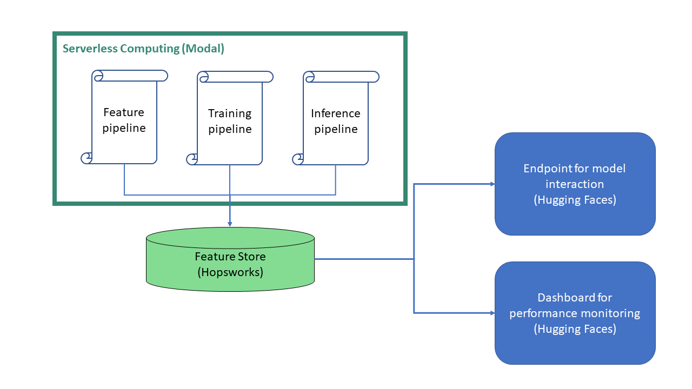

# Scalable End-To-End Machine Learning Workflow

## Overview
This repository contains the code for the first assignment in the course ID2223 at KTH. The goal was to build a modular machine learning application where the different components are able to scale to the amount of resources they need. We use the titanic data set to train a K-NN model which can be monitored and interacted with on Hugging Face. The basic architecture is shown in the image below. It builds upon three different platforms, each with its own specific purpose. We use Hopsworks as a feature store where the (continuosly growing) data is placed, as well as the model that uses it and additional results (like visualizations). The computations run serverless on Modal although it is possible to execute the code locally, too. Finally, a user interface is provided on Huggingface to interact with the model and get a prediction for a given data point. A second UI on Huggingface provides a Dashboard showing the overall performance of the model in terms of a confusion matrix, as well as the last couple of predictions. 



## How it works and how to deploy

Assuming that you have set up the API keys for all of the platforms, follow the steps below to deploy the application:

1. Execute `titanic-feature-pipeline.py` (either locally or on Modal), but make sure that the variable `BACKFILL` is set to True. This will download the original Titanic dataset, preprocess it and store the features and labels on Hopsworks. We chose to keep only the four most intuitive features as input to the model in order to ensure a good experience when interacting with the model on Hugging Face. The features we kept are the passenger class, sex, age and ticket price.

```console
python titanic-feature-pipeline.py
```

2. In order to simulate a never ending daily stream of new data points that are added to the feature store, you can set `BACKFILL`to False again and deploy the script on Modal with the command below. The script will be executed on a daily schedule and generate and upload a new data point each time.

```console
modal app deploy titanic-feature-pipeline.py
```

3. Next up, we need to train a model using the titanic-training-pipeline.py script. Every time it is executed, a new K-NN model is trained and uploaded to Hopsworks including evaluation results like a confusion matrix and the accuracy score. Like in the previous steps, it is possible to run the code either once locally / on Modal or daily as a deployment on Modal. Choose one of the commands below:

```console
// Option 1 - run once
python titanic-training-pipeline.py

// Option 2 - deploy on Modal and execute with daily schedule
modal app deploy titanic-training-pipeline.py
```

4. For the Hugging Face dashboard that shows the latest performance of the model, it is necessary to apply it regularly to the most recent data. Assuming that the feature pipeline was deployed with daily schedule, the command below deploys an inference pipeline with daily schedule that creates a prediction for the latest data point and generates a confusion matrix and DataFrame image that shows the outcome of the last predictions. The results are uploaded to Hopsworks to be accessible.

```console
modal app deploy titanic-batch-inference-pipeline.py
```

5. Finally, create two separate spaces on Hugging Face based on the contents of the folders `huggingface-spaces-titanic` (UI to interact with the model) and `huggingface-spaces-titanic-monitor` (Dashboard summarizing the latest results). Note however, that the dashboard app does not include results obtained with the interactive UI.

After following these steps, you have deployed a scalable and modular machine learning pipeline that re-trains the model regularly on a never ending incoming stream of data. Furthermore, you have deployed the model on an endpoint where you can interact with it and created a Dashboard to monitor model performance. Congrats!

To see how the result should look like, check out the [interactive UI](https://huggingface.co/spaces/Neprox/Titanic-Survival) and [monitoring dashboard](https://huggingface.co/spaces/Neprox/Titanic-Monitoring) on Huggingface.
